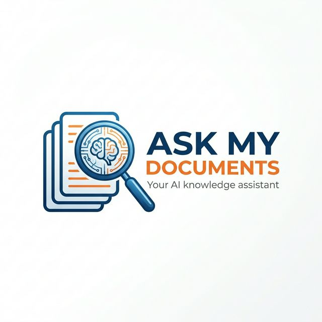
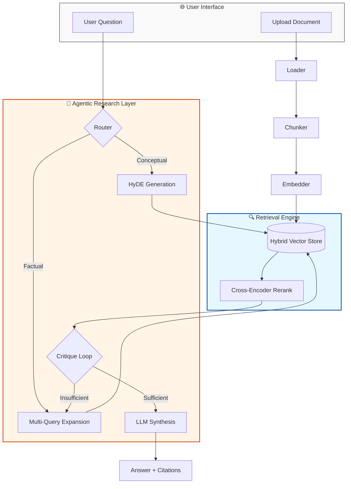

<div align="center">
  
  <h1>Ask My Documents</h1>
  <p><strong>A Privacy-First, Agentic RAG Platform for Local Document Intelligence</strong></p>

  [](https://github.com/SakthiQ/ask-my-docs/blob/main/LICENSE)
  [](https://www.python.org/)
  [](https://fastapi.tiangolo.com/)
  [](https://ollama.com/)
  []()
</div>

---

## 🎯 What is Ask My Documents?

**Ask My Documents** is an enterprise-grade, privacy-first Retrieval-Augmented Generation (RAG) system. It transforms your local PDFs, DOCX, and Markdown files into an interactive knowledge base—completely offline.

> [!IMPORTANT]
> **100% Local Logic**: No data ever leaves your machine. We use Ollama for LLM inference and Sentence-Transformers for local embeddings.

---

## ✨ Cutting-Edge Features

| Feature | Description | Status |
| :--- | :--- | :---: |
| 🤖 **Agentic Loops** | Self-critiquing cycles that verify answer quality and refine search. | ✅ |
| 🛣️ **Smart Routing** | Dynamic query routing using HyDE (Hypothetical Document Embeddings). | ✅ |
| 🔍 **Hybrid Search** | Combines Semantic Vector (Chroma) + Keyword (BM25) search. | ✅ |
| 🧠 **Cross-Encoder** | State-of-the-art re-ranking for maximum citation accuracy. | ✅ |
| 📑 **Exact Citations** | Precise page, paragraph, and source file tracking. | ✅ |
| ⚡ **Fast Path** | Optimized retrieval for simple factual questions. | ✅ |

---

## 🏗️ The Brain: Agentic Architecture



---

## � Quick Start (5 Minutes)

### 1. Prerequisite Checklist
*   [ ] **Python 3.11+** installed.
*   [ ] **Ollama** installed and running.
*   [ ] Run `ollama pull llama3`.

### 2. Setup
```powershell
# Clone & Navigate
git clone https://github.com/SakthiQ/ask-my-docs.git
cd ask-my-docs

# Environment Initialization
python -m venv .venv
.\.venv\Scripts\Activate.ps1
pip install -r requirements.txt
```

### 3. Launch
```powershell
# Start the Backend
uvicorn app.main:app --reload

# Start the Frontend (New!)
streamlit run frontend/streamlit_app.py
```

---

## 📚 API Guide

<details>
<summary>📂 <b>View Endpoints & Examples</b></summary>

### Upload Document
`POST /upload`
```bash
curl -X POST "http://127.0.0.1:8000/upload" -F "file=@/path/to/Policy.pdf"
```

### Ask AI
`POST /query`
```json
{
  "question": "What is the annual leave policy?"
}
```

</details>

---

## �️ Technology Stack

*   **Orchestration**: LangChain, FastAPI
*   **Vector Database**: ChromaDB (Atomic Persistence)
*   **Search**: Hybrid (Vector + BM25Okapi)
*   **Re-ranking**: `cross-encoder/ms-marco-MiniLM-L-6-v2`
*   **Embeddings**: HuggingFace `all-MiniLM-L6-v2`
*   **Logging**: Loguru & Tenacity (Retry Logic)

---

## 📈 Roadmap

- [x] **Phase 1-3**: Basic RAG, FastAPI, and Advanced Retrieval.
- [x] **Phase 4**: Hybrid Search & Cross-Encoder Reranking.
- [x] **Phase 5**: Agentic Research Loops & HyDE Routing.
- [ ] **Phase 6**: Multimodal Support (Images/Tables in PDFs).
- [ ] **Phase 7**: Evaluation Framework (RAGAS).

---

<div align="center">
  <p>Built with ❤️ for Privacy and Performance.</p>
  <a href="#table-of-contents">Back to Top</a>
</div>

